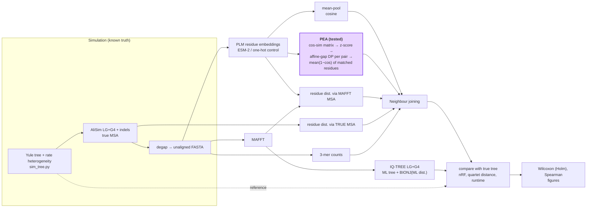

# MSA-free phylogeny from residue-level protein language model embeddings

*Microbial Omics 2026, mini-project 1 (Phylogenomics) — "Embedding-based phylogeny"*

## Problem

Protein language models (PLMs) are increasingly used as an alignment-free shortcut for
comparing proteins. For phylogenetics, however, compressing a protein into one vector
(mean-pooling) destroys most of the phylogenetic signal, whereas accumulating distances
over **residue-level** embeddings recovers topology well — but only when residues are
matched through a **multiple sequence alignment** (Stakauskas & Górecki 2026). That makes
the PLM route no cheaper and no more robust than classical pipelines; the authors name
"recovering residue-level signal without an MSA" as the open problem.

Embedding-based *pairwise* alignment (EBA, pLM-BLAST) already exists, but it has been
developed for homology / structure detection, not for building trees.

## Idea

**PEA — Pairwise Embedding Alignment distances.** For every pair of sequences:
residue × residue cosine-similarity matrix → EBA-style z-score enhancement → affine-gap
dynamic-programming alignment → distance = mean (1 − cos) over matched residue pairs
(+ optional unmatched-fraction term) → neighbour joining. No MSA anywhere.

## Hypotheses

| | Statement | Test |
|---|---|---|
| **H0** | PEA trees are no closer to the true tree than mean-pooled-embedding trees | — |
| **H1** | PEA trees are closer to the true tree (lower nRF) than mean-pool trees | one-sided paired Wilcoxon per model × divergence, Holm-corrected |
| **H1b** | The advantage of PEA over MSA-based NJ grows with divergence (MSA error grows) | Spearman ρ(height, nRF<sub>PEA</sub> − nRF<sub>BIONJ</sub>) |

Additional comparisons: PEA vs the MSA-based residue-distance upper bound (MAFFT and
TRUE MSA), IQ-TREE ML, BIONJ on ML distances, and a 3-mer alignment-free baseline.
A **one-hot "embedding" control** separates the contribution of the language model
from the contribution of the alignment procedure itself.

## Pipeline



Same diagram in `docs/pipeline.mmd` (render as PNG/SVG at mermaid.live for the slides).

Text version:

```
simulate (Yule tree + lognormal rate heterogeneity → AliSim LG+G4 + indels)
  → degap → { MAFFT | PLM residue embeddings | 3-mers }
  → distances { meanpool | PEA | residue-dist via MAFFT / TRUE MSA | kmer }
  → NJ   (+ IQ-TREE ML and BIONJ as classical references)
  → nRF / quartet distance to the true tree, runtime → tests & figures
```

## Quick start

```bash
conda env create -f environment.yml && conda activate msafree-phylo
pytest -q tests/                                                     # 3 unit tests, <1 s
snakemake -s workflow/Snakefile --configfile config/smoke.yaml --cores 4   # ~5 min, CPU, no downloads
snakemake -s workflow/Snakefile --cores 8                            # full grid (config/config.yaml)
```

Outputs:

- `results/summary.tsv` — one row per dataset × method × model (nRF, nQD, seconds)
- `results/stats/tests.tsv` — all hypothesis tests with Holm-adjusted p-values
- `results/figures/fig1_accuracy_vs_divergence.{pdf,png}` — main figure
- `results/figures/fig2_pea_minus_meanpool.{pdf,png}` — paired effect for H1
- `results/figures/fig3_runtime_vs_accuracy.{pdf,png}`

ESM-2 weights are downloaded by `fair-esm` on first use (~140 MB for 35M).
**ESM-C** (optional) needs EvolutionaryScale's `esm` package, which clashes with `fair-esm`
(same import name): create a second env, `pip install esm`, and run only the `embed` rule there.

## Repository layout

```
config/config.yaml        full experiment grid and method parameters
config/smoke.yaml         tiny grid for CI / quick checks
workflow/Snakefile        the whole pipeline
workflow/scripts/         one script per step; core logic in common.py and dist_emb.py
tests/                    unit tests (NJ, RF/quartets, PEA alignment)
docs/pipeline.mmd         methods diagram for the slides
docs/decisions.md         log of design decisions (why, not what)
AGENTS.md                 instructions for coding agents working in this repo
todo.md                   plan and status
```

## References

- Stakauskas B., Górecki P. Analysis of phylogenetic signal in protein language model embeddings. *Sci Rep* 16, 22051 (2026). doi:10.1038/s41598-026-57699-5
- Pantolini L. et al. Embedding-based alignment: combining protein language models with dynamic programming alignment to detect structural similarities in the twilight-zone. *Bioinformatics* 40, btad786 (2024).
- Lin Z. et al. Evolutionary-scale prediction of atomic-level protein structure with a language model. *Science* 379, 1123–1130 (2023). (ESM-2)
- Ly-Trong N. et al. AliSim: a fast and versatile phylogenetic sequence simulator for the genomic era. *Mol Biol Evol* 39, msac092 (2022).
- Minh B.Q. et al. IQ-TREE 2. *Mol Biol Evol* 37, 1530–1534 (2020).
- Katoh K., Standley D.M. MAFFT multiple sequence alignment software version 7. *Mol Biol Evol* 30, 772–780 (2013).
- Nesterenko L. et al. Phyloformer: fast, accurate, and versatile phylogenetic reconstruction with deep neural networks. *Mol Biol Evol* 42, msaf051 (2025).
- Lupo U., Sgarbossa D., Bitbol A.-F. Protein language models trained on multiple sequence alignments learn phylogenetic relationships. *Nat Commun* 13, 6298 (2022).
